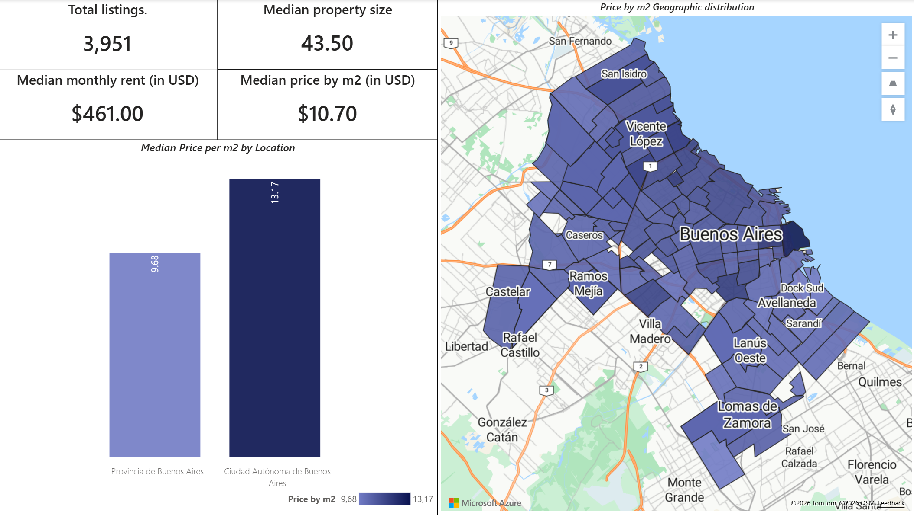
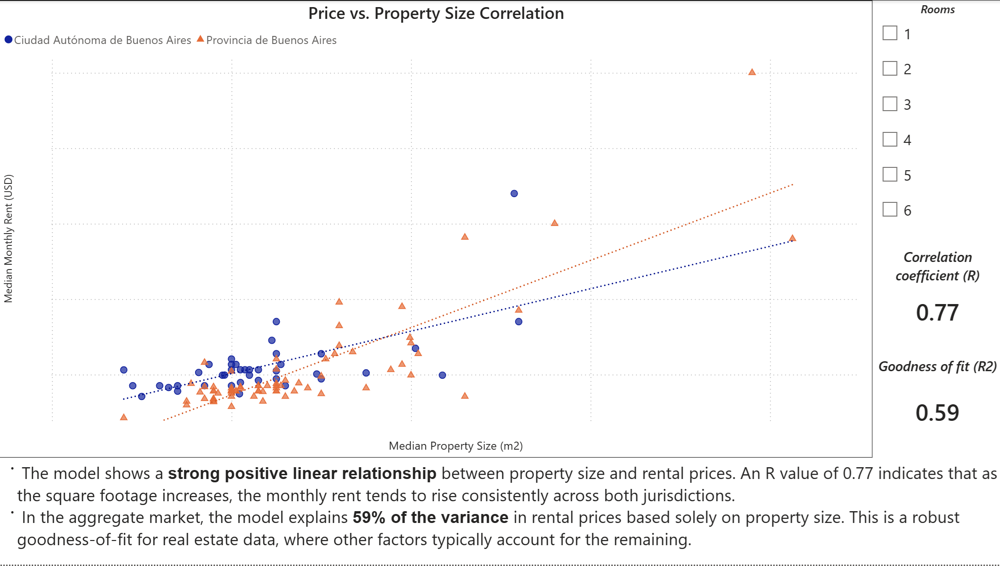

# Housing Rent Analytics ARG 🏠
### Residential Rental Market Analysis — CABA & Greater Buenos Aires

End-to-end data pipeline covering web scraping, SQL cleaning, and interactive Power BI dashboards to analyze the Argentine rental market. Built from real data scraped in late 2025 across 10+ locations.

---

## 📊 Dashboard Preview

### Market Overview & Geographic Distribution
.
*KPIs, median price per m² by region, and choropleth map of Buenos Aires.*

### Price vs. Property Size Correlation

*Scatter plot with linear regression by jurisdiction (CABA vs. GBA), R = 0.77, R² = 0.59.*

---

## 🔍 Key Findings

- **CABA costs 36% more per m² than GBA** — median of USD 13.17/m² vs USD 9.68/m², a meaningful gap for anyone optimizing the price/location tradeoff.
- **Property size is a strong predictor of rent**, with a correlation coefficient of R = 0.77. The regression model explains 59% of rental price variance using square footage alone.
- **The relationship holds differently by region** — GBA shows a steeper price-per-size slope than CABA, suggesting that larger properties in the suburbs carry a relatively higher premium than equivalent units in the city.
- **Median monthly rent: USD 461** across 3,951 listings, with a median property size of 43.50 m².

---

## 🛠️ Pipeline Overview

### 1. Data Extraction — Python
- Scraped 3,951 listings from Argenprop across CABA and 10+ GBA locations (San Isidro, Vicente López, Avellaneda, Lomas de Zamora, and others)
- Built 10 independent Python scrapers, one per geographic region, for automated and maintainable data collection
- Used LLMs as a development tool to iterate on scraper architecture — all logic, validation, and data decisions were made manually

### 2. SQL Data Transformation
- **Normalization:** Standardized city and neighborhood names; mapped CABA listings to their corresponding Comunas
- **Imputation:** Addressed missing values in area, expenses, and rooms using median-based imputation grouped by geographic cluster
- **Currency standardization:** Converted all listings to USD using a consistent exchange rate for cross-sectional comparability
- **Deduplication:** Removed redundant records using CTEs and window functions

### 3. Power BI Analysis
- **Choropleth map:** Rental density and median price per m² visualized across Partidos (GBA) and Comunas (CABA)
- **Correlation analysis:** Scatter plot with regression lines per jurisdiction, displaying R and R² as dynamic KPIs
- **Market KPIs:** Median rent, price per m², property size, and total listing count

---

## 📁 Repository Structure

```
├── scripts/          # 10 Python scrapers, one per geographic region
├── sql/
│   └── data_cleaning.sql   # Full cleaning, normalization, and feature engineering logic
├── powerbi/
│   └── rent_project.pbix   # Power BI dashboard with data model and visualizations
└── images/           # Dashboard screenshots for README
```

> **Note:** Raw CSV files are excluded from this repository due to size constraints. The SQL cleaning script is designed to run against the schema generated by the scrapers.

---

## 🧰 Tech Stack

`Python` · `SQL (CTEs, Window Functions)` · `Power BI (DAX, Power Query)` · `Pandas`

---

## 👤 Author

**Nahuel Ariza** — [LinkedIn](https://linkedin.com/in/nahuariza) · [GitHub](https://github.com/arizanahuel)
